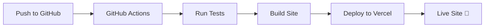

# 🎨 Portfolio Website

<div align="center">
  
### A modern, responsive portfolio website built with Eleventy

[](https://devrac.vercel.app/)
[](https://github.com/Devatva24/portfolio/stargazers)
[](LICENSE)
[](https://github.com/Devatva24/portfolio/actions)

[View Demo](https://devrac.vercel.app/) · [Report Bug](https://github.com/Devatva24/portfolio/issues) · [Request Feature](https://github.com/Devatva24/portfolio/issues)

</div>

---

## 📋 Table of Contents

- [Overview](#-overview)
- [Features](#-features)
- [Tech Stack](#️-tech-stack)
- [Project Structure](#-project-structure)
- [Available Scripts](#-available-scripts)
- [Customization](#-customization)
- [Deployment](#-deployment)
- [Performance](#-performance)
- [Contributing](#-contributing)
- [License](#-license)
- [Contact](#-contact)

---

## 🚀 Overview

This is my personal portfolio website showcasing my projects, skills, and professional experience. Built with performance and accessibility in mind, the site features a clean, modern design that works seamlessly across all devices.

---

## ✨ Features

<table>
<tr>
<td width="50%">

### 🎯 Core Features
- 🎨 Clean and modern UI/UX design
- 📱 Fully responsive layout
- ⚡ Fast loading times with SSG
- ♿ Accessible and SEO-friendly
- 🔍 Built-in search functionality

</td>
<td width="50%">

### 🛠️ Developer Features
- 📝 Markdown-based content
- 🔄 Hot reload in development
- ✅ Spell-checking integrated
- 🤖 Automated CI/CD pipeline
- 📊 Performance monitoring

</td>
</tr>
</table>

---

## 🛠️ Tech Stack

<div align="center">


</div>

| Technology | Purpose |
|------------|---------|
| **Eleventy (11ty)** | Static site generator for fast, modern websites |
| **Nunjucks** | Templating engine for dynamic content |
| **CSS** | Styling and responsive design |
| **Markdown** | Content management and documentation |
| **Vercel** | Hosting and continuous deployment |
| **GitHub Actions** | Automated testing and deployment workflows |

---

## 📂 Project Structure

```
portfolio/
│
├── 📁 _includes/              # Reusable template components
│   ├── layouts/               # Page layouts
│   ├── partials/              # Partial templates (header, footer)
│   └── components/            # UI components
│
├── 📁 assets/                 # Static assets
│   ├── css/                   # Stylesheets
│   ├── js/                    # JavaScript files
│   ├── images/                # Images and graphics
│   └── fonts/                 # Custom fonts
│
├── 📁 projects/               # Project markdown files
│   ├── project-1.md
│   ├── project-2.md
│   └── project-3.md
│
├── 📁 .github/workflows/      # CI/CD workflows
│   └── deploy.yml             # Automated deployment
│
├── 📁 .husky/                 # Git hooks configuration
│   └── pre-commit             # Pre-commit checks
│
├── 📁 .vscode/                # VS Code settings
│   └── settings.json          # Workspace configuration
│
├── 📄 eleventy.config.js      # Eleventy configuration
├── 📄 index.njk               # Homepage template
├── 📄 template.md             # Template for new pages
├── 📄 sitemap.md              # Sitemap generation
├── 📄 package.json            # Dependencies & scripts
├── 📄 .cspell.json            # Spell-check config
├── 📄 .markdownlint.json      # Markdown linting
└── 📄 README.md               # This file
```

---

## 🏃‍♂️ Getting Started

### Prerequisites


Make sure you have Node.js and npm installed on your machine.

### Installation

1️⃣ **Clone the repository**
```bash
git clone https://github.com/Devatva24/portfolio.git
cd portfolio
```

2️⃣ **Install dependencies**
```bash
npm install
```

3️⃣ **Start the development server**
```bash
npm start
```

4️⃣ **Open your browser**
```
http://localhost:8080
```

🎉 **You're all set!** The site should now be running locally with hot reload enabled.

---

## 📝 Available Scripts

| Command | Description |
|---------|-------------|
| `npm start` | 🚀 Start development server with hot reload |
| `npm run build` | 🏗️ Build the site for production |
| `npm run serve` | 🌐 Preview production build locally |
| `npm run spell-check` | 🔍 Run spell checker on content |
| `npm run lint:md` | ✅ Lint markdown files |
| `npm run format` | 💅 Format code with Prettier |
| `npm run clean` | 🧹 Clean build directory |

### Development Workflow

```bash
# 1. Create a new branch
git checkout -b feature/new-project

# 2. Start development server
npm start

# 3. Make your changes
# ...

# 4. Check for issues
npm run spell-check
npm run lint:md

# 5. Build and test
npm run build
npm run serve

# 6. Commit and push
git add .
git commit -m "Add new project"
git push origin feature/new-project
```

---

## 🎨 Customization

### 🆕 Adding a New Project

1. Create a new markdown file in `projects/` directory:
```bash
touch projects/my-awesome-project.md
```

2. Use this template:
```markdown
---
title: "My Awesome Project"
description: "A brief description of your project"
tags: ["JavaScript", "React", "Node.js"]
image: "/assets/images/project-thumbnail.jpg"
link: "https://github.com/yourusername/project"
date: 2024-01-15
featured: true
---

# My Awesome Project

Detailed description of your project...

## Features
- Feature 1
- Feature 2

## Technologies Used
- Tech 1
- Tech 2
```

3. Add project images to `assets/images/`

4. The project will automatically appear on the site! ✨

### 🎨 Modifying Styles

**CSS Variables** (in `assets/css/variables.css`):
```css
:root {
  --primary-color: #667eea;
  --secondary-color: #764ba2;
  --text-color: #333;
  --background-color: #fff;
  --font-family: 'Inter', sans-serif;
}
```

**Dark Mode** (optional):
```css
@media (prefers-color-scheme: dark) {
  :root {
    --text-color: #fff;
    --background-color: #1a1a1a;
  }
}
```

### 📝 Updating Content

- **Homepage**: Edit `index.njk`
- **About**: Edit `_includes/about.njk`
- **Projects**: Add/edit files in `projects/`
- **Layouts**: Modify `_includes/layouts/`

---

## 🚀 Deployment

### Automatic Deployment (Vercel)

This site is configured for automatic deployment:



✅ **Deploys automatically** on push to `main` branch  
✅ **Preview deployments** for pull requests  
✅ **Instant rollbacks** if needed  

### Manual Deployment

```bash
# Build the site
npm run build

# Deploy to Vercel
vercel --prod

# Or deploy to Netlify
netlify deploy --prod --dir=_site
```

### Environment Variables

Create a `.env` file for local development:
```env
SITE_URL=https://devrac.vercel.app
ANALYTICS_ID=your-analytics-id
```

---

## 📊 Performance

<div align="center">

### Lighthouse Scores


</div>

### Optimization Features

| Feature | Benefit |
|---------|---------|
| ⚡ Static HTML Generation | Lightning-fast page loads |
| 🖼️ Optimized Images | Reduced bandwidth usage |
| 📦 Minified Assets | Smaller file sizes |
| 🔍 SEO Optimized | Better search rankings |
| ♿ Accessible | WCAG 2.1 compliant |
| 📱 Responsive | Works on all devices |

### Bundle Size

```
CSS:  ~15KB (minified + gzipped)
JS:   ~8KB  (minified + gzipped)
HTML: ~12KB (minified + gzipped)
```

---

## 🤝 Contributing

Contributions, issues, and feature requests are welcome!

<div align="center">

[](https://github.com/Devatva24/portfolio/graphs/contributors)
[](https://github.com/Devatva24/portfolio/issues)
[](https://github.com/Devatva24/portfolio/pulls)

</div>

### How to Contribute

1. 🍴 **Fork** the repository
2. 🔨 **Create** your feature branch
   ```bash
   git checkout -b feature/AmazingFeature
   ```
3. ✍️ **Commit** your changes
   ```bash
   git commit -m 'Add some AmazingFeature'
   ```
4. 📤 **Push** to the branch
   ```bash
   git push origin feature/AmazingFeature
   ```
5. 🎉 **Open** a Pull Request

### Code of Conduct

Please read our [Code of Conduct](CODE_OF_CONDUCT.md) before contributing.

---

## 📄 License

This project is licensed under the **MIT License** - see the [LICENSE](LICENSE) file for details.

```
MIT License

Copyright (c) 2024 Devatva24

Permission is hereby granted, free of charge, to any person obtaining a copy
of this software and associated documentation files (the "Software"), to deal
in the Software without restriction...
```

---

## 📧 Contact

<div align="center">

### Let's Connect! 🤝

[](https://devrac.vercel.app/)
[](https://github.com/Devatva24)
[](https://linkedin.com/in/devatva-rachit-317a11229)
[](https://x.com/DevatvaR)
[](mailto:rachitdevatva722448@gmail.com)

</div>

---

<div align="center">

### Show your support

Give a ⭐️ if you like this project!

**Built with ❤️ using Eleventy**

</div>
